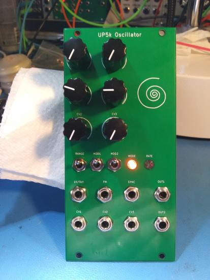
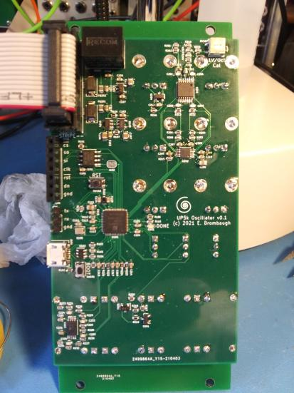

# up5k_osc
An FPGA-based digital oscillator for Eurorack

## What is it?
up5k_osc is a Eurorack-format digital oscillator demonstrating digital
audio synthesis with a low-cost FPGA. It supports several basic waveforms
commonly found in analog synthesizers, but generated digitally at very high
sample rates to avoid many of the problems with aliasing that occur when
these waveforms are synthesized at lower sample rates.

## Features
​
* 12HP wide 3U standard Eurorack module
* +/-12V supply on Doepfer-standard 16-pin shrouded, keyed header (30ma max)
* Trimmed 1V/Oct pitch control input with coarse and fine adjustment pots
* Attenuated Exponential FM input
* 3 additional uncommited +/-5V CV inputs with associated setting pots
* Sync input
* Two +/-5V range audio outputs
* Three 3 position toggles for range and mode control
* RGB LED indicator
* Additional single LED indicator
* USB-based firmware updates

## Design details
* Lattice iCE40 Ultra Plus 5k FPGA
* 4MB SPI Flash memory for configuration data, firmware and tables.
* 4-channel 12-bit SPI ADC with 500kSPS max sample rate
* Direct-access SPI Programming header
* 3-pin diagnostic header (2 data + ground)
* Reset and Bootloader pushbuttons
* Done Program LED
* Buck SMPS regulator for low current draw from +12V supply
* Differential PDM DACs for high-resolution, high sample rate and low THD audio

## Resources
* [Schematic](docs/up5k_osc_schematic.pdf)
* [BOM](docs/up5k_osc_bom.ods)

## Motivation
One of the most thorny issues encountered when attempting to synthesize simple
analog waveforms in the digital domain is that of aliasing which occurs due
to sharp transitions coupled with low sample rates. Seemingly "obvious" methods
of generating simple waveforms like sawtooths and square or pulse waves fail
miserably when the sharp edges of these waveforms jitter around due to the low
timing resolution of practical DSP sample rates. Mountains of research have been
devoted to DSP approaches to minimizing this edge jitter using techniques such
as BLIT, BLEP, MinBLEP, PolyBLEP, DPW, etc. These work, but end up becoming
compromises between the complexity of the approach (and the consequent CPU load
they impose) and the degree of alias rejection that they provide.

The brute-force approach is to synthesize these analog waveforms at sufficiently
high sample rates that the timing jitter becomes imperceptible. This is the
method that up5k_osc uses - an audio-rate oscillator is synthesized at sample
rates in excess of 10MHz which knocks the aliases of even the buzziest narrow
pulse wave down below 80dBfs. Differential Pulse Density Modulation is used to
do the digital-to-analog conversion in an enexpensive yet highly linear fashion.

## Theory of Operation
The up5k_osc system comprises a power supply, ADC, Flash Memory, FPGA and analog
I/O processing. 

### Power Supply
Eurorack systems typically provide +/-12V rails at a minimum, and as DSP becomes
a more common feature in typical racks, the +12V rails are disproportionally
loaded down by the use of simple LDO linear regulators to supply the high currents
needed by most modern digital components. up5k_osc uses a SMPS regulator module
to efficiently provide an internal 5V supply from which 3.3V analog and digital
supplys can be derived with less heat and waste.

### Analog Input Processing
A 4-channel 12-bit 500kSPS SPI ADC is used to digitize control voltage inputs
to the up5k_osc. One channel is dedicated to handling the typical 1V/Oct pitch
control and includes trimming to calibrate the 1V/Oct slope, as well as coarse
and fine user offsets as well as summing an attenuated FM input. This provides
roughly 2.7cents/lsb pitch resolution over a 10V range which covers most of
the musical range to an accuracy better than the commonly accepted human
perception.

The other three ADC channels are uncommitted CV inputs with offset controls and
a 10Vpp range. Running that the maximum rated conversion speed, the ADC can
provide 125kSPS per channel which is sufficiently high to provide good temporal
resolution.

### FPGA and SPI Flash
The Lattice iCE40 Ultra Plus 5k FPGA provides a modest gate count, a number of
useful hard IP cores, including SPI, I2C, Multiply-Accumulate and large RAM.
These resources are sufficient for reasonably complex DSP, soft processor cores
and I/O tasks. In the up5k_osc, the FPGA is loaded from the SPI Flash at power
up and immediately begins execution of a basic processing pipeline which begins
with driving a continuous stream of conversions from the ADC, formatting the
results for control of a fast internal NCO, waveshaping and then finally
generating the PDM output signals.

FPGA bitstreams, along with soft processor firmware and synthesis tables are
stored in the SPI flash. During development it's often simplest to directly load
the FPGA over the SPI configuration bus via a programming dongle and header on
the board, bypassing the SPI flash. In end-use situations however it's desirable
to have a simpler approach, and for that purpose a USB interface is provided
which uses the NO2 bootloader and the standardized DFU protocol to load data
into the SPI flash without extra hardware.

[NO2 Bootloader](https://github.com/no2fpga/no2bootloader)

The up5k_osc FPGA pinout for USB, SPI Flash and boot select button + LED has
been designed to follow that of the icebreaker bitsy, so building the
bootloader with that configuration will generate a usable bitstream.

### Switches and LEDs
User control options are provided in the form of three 3-position SPDT toggles
(on-off-on) which can be used to set pitch range, waveform types, etc. A few
LEDs are also provided to indicate operating conditions.

### Analog Outputs
Two PDM DACs are available with fully differential inputs from the FPGA to
improve linearity despite mismatches in rise & fall timing. A two-stage
lowpass reconstruction filter rolls off at about 30kHz, allowing harmonic
content well above normal human hearing range. SNR has been observed as better
that 90dBfs, THD for 1kHz sine is better than 80dBfs and with 16MSPS sample
rates the aliasing on naive sawtooth waveforms are lower than 80dBfs beyond
10kHz. Output levels of 10Vpp are compatible with common Eurorack standards.

